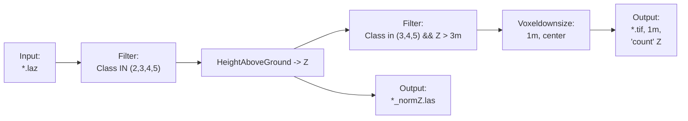
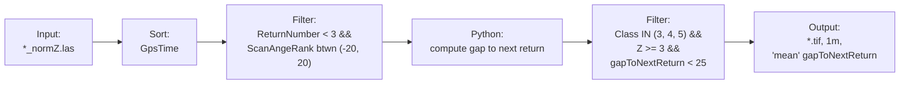

# Beschrieb Pipelines

## Tree Volume (Voxel Count)

```mermaid
flowchart LR

A[Input:<br/>*.laz] --> B["Filter:<br/>Class IN (2,3,4,5)"]
B --> C[HeightAboveGround -> Z]
C --> D["Filter:<br/>Class in (3,4,5) && Z > 3m"]
C --> F["Output:<br/>*_normZ.las"]
D --> E["Voxeldownsize:<br/>1m, center"]
E --> G["Output:<br/>*.tif, 1m,<br/>'count' Z"]
```

## Tree Type (Distance Gap between Repetitions)

```mermaid
flowchart LR

A[Input:<br/>*_normZ.las] --> B[Sort:<br/>GpsTime]
B --> C["Filter:<br/>ReturnNumber < 3 &&<br/>ScanAngeRank btwn (-20, 20)"]
C --> D[Python:<br/>compute gap to next return]
D --> E["Filter:<br/>Class IN (3, 4, 5) &&<br/>Z >= 3 &&<br/>gapToNextReturn < 25"]
E --> G[Output:<br/>*.tif, 1m,<br/>'mean' gapToNextReturn]
```
